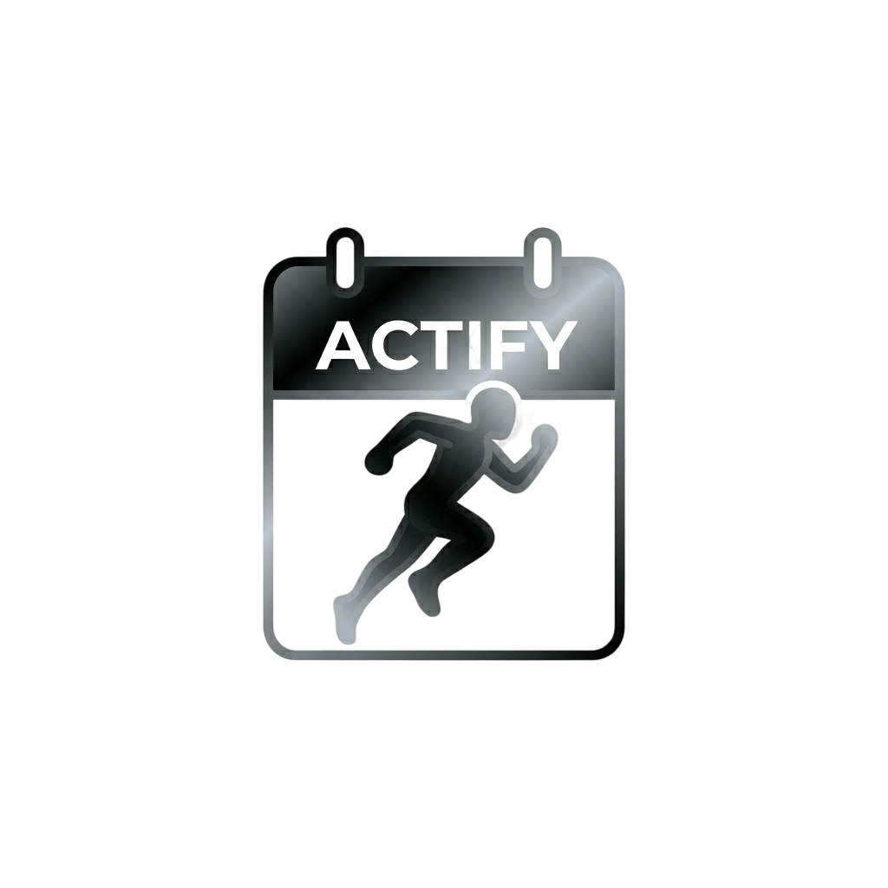
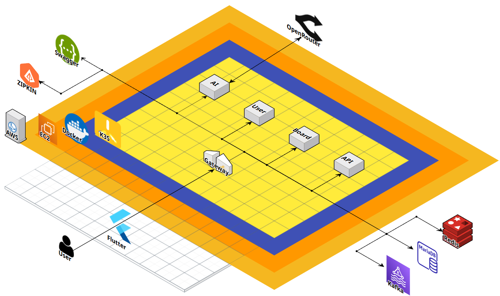

# 🤖 라이프스타일 혁신을 위한 AI Agent 기반 SW

<div align="center">
  
</div>
<br/>

> **사용자의 일상 데이터를 기반으로 스스로 판단하고, 외부 서비스와 직접 상호작용하여 일정을 관리하는 자율형 AI 에이전트** [cite: 28, 29]

<br/>

## 📜 목차

- [프로젝트 개요](#-프로젝트-개요)
- [팀 소개](#-팀-소개)
- [핵심 기능](#-핵심-기능)
- [시스템 및 아키텍처](#-시스템-및-아키텍처)
- [기술 스택](#-기술-스택)
- [시작 가이드](#-시작-가이드)

---

## 💡 프로젝트 개요

### 1. 기획 배경 및 필요성

일정 조율이나 기상 변화에 따른 야외 일정 수정 등, 현대인은 분산된 서비스 환경 속에서 수동적인 정보 처리로 인한 피로감을 느끼고 있습니다. 기존의 AI 챗봇은 "오늘 비가 옵니다"와 같은 단순 정보만 제공할 뿐, 실제 일정표를 수정하는 행동(Action)으로 이어지지 않는 한계가 있습니다.

### 2. 목표 및 기대효과

본 프로젝트는 거대언어모델(LLM)의 추론 능력과 외부 API 연동 기술을 결합하여, 사용자의 상황을 인지하고 선제적으로 행동하는 **실행 중심형 AI(Action-oriented AI)**를 개발하는 것을 목표로 합니다. 이를 통해 반복적이고 소모적인 디지털 작업에서 벗어나 개인의 생산성을 획기적으로 높이고 일상의 질을 개선하고자 합니다0

- **개발 기간:** 2026년 3월 3일 ~ 2026년 6월 17일 (약 3개월)

---

## 👥 팀 소개 (Team Actify)

|                                   안수현 (팀장)                                   |                                      서진현                                       |                                      홍순기                                       |                                      이동헌                                       |
| :-------------------------------------------------------------------------------: | :-------------------------------------------------------------------------------: | :-------------------------------------------------------------------------------: | :-------------------------------------------------------------------------------: |
|  |  |  |  |
|                                 **PO / BE / DB**                                  |                                      **BE**                                       |                                      **FE**                                       |                                   **BE / RAG**                                    |
|                     [GitHub](https://github.com/Ahn-SooHyun)                      |                           [GitHub](https://github.com/)                           |                           [GitHub](https://github.com/)                           |                           [GitHub](https://github.com/)                           |

<details>
<summary><strong>💡 팀원별 상세 역할</strong></summary>
  
### 안수현 (PO / Backend / DB)
- 프로젝트 요구사항 정의 및 도메인(일정, 건강 등) 우선순위 설계 
- 백엔드 아키텍처 구축 및 데이터베이스(DB) 모델링 최적화

### 서진현 (Backend)

- 백엔드 API 서버 구축 및 비동기 처리 로직 구현
- 캘린더, 메일, 헬스케어 등 외부 서비스 API 연동 로직 개발

### 홍순기 (Frontend)

- 사용자 직관적 웹 인터페이스 및 AI 대화창 UI/UX 개발
- 작업 수행 결과 리포팅 화면 및 클라이언트 로직 구현

### 이동헌 (Backend / RAG)

- RAG(검색 증강 생성) 파이프라인 구축 및 프롬프트 엔지니어링
- Vector DB 연동 및 Lang Chain 기반 에이전틱 워크플로 구현
</details>

---

## 🔊 핵심 기능

1. **지능형 자연어 명령 분해 (Agentic Workflow)**
   사용자의 모호하고 복잡한 명령(예: "이번 주말 내 컨디션에 맞춰 운동 예약해 줘")을 LLM이 분석하여 캘린더 확인, 운동 시간 확보 등의 구체적인 하위 작업으로 세분화합니다.
2. **개인화된 문맥 유지 (RAG & Vector DB)**
   사용자의 과거 일정, 취향 데이터 등 개인 데이터를 벡터 데이터베이스에 안전하게 저장하고 실시간으로 참조하여, 시간이 지날수록 사용자에게 최적화된 결과물을 도출합니다.
3. **능동적 작업 처리 및 외부 API 제어 (Action-oriented)**
   AI가 스스로 적절한 도구(Tool)를 선택하고 캘린더, 알림, 검색 등 외부 도구와 연동하여 실제 예약 및 일정 변경 등의 액션을 최종적으로 완료합니다.
4. **연속 피드백 루프 아키텍처**
   에이전트가 수행한 결과에 대해 사용자가 피드백을 제공하면 이를 지속해서 학습 데이터에 반영하는 지능형 루프를 구성합니다.

---

## 🖥 시스템 및 아키텍처

### System Architecture



### ERD (Entity Relationship Diagram)


---

## 🛠 기술 스택

### Backend & AI

    

### Frontend

 

### Tools & Collaboration

  

---

## 🚀 시작 가이드 (Getting Started)

### Prerequisites

- Python 3.10+
- Node.js 18+

### Installation

1. 저장소를 클론합니다.

```bash
git clone [https://github.com/Team-Actify/Actify-Project.git](https://github.com/Team-Actify/Actify-Project.git)
```
